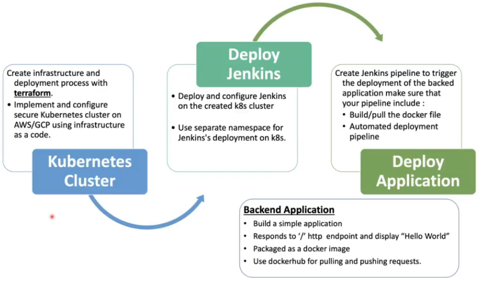
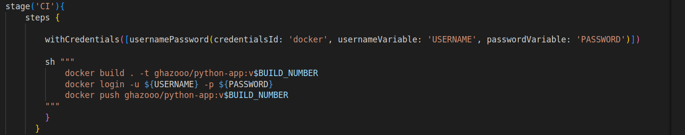
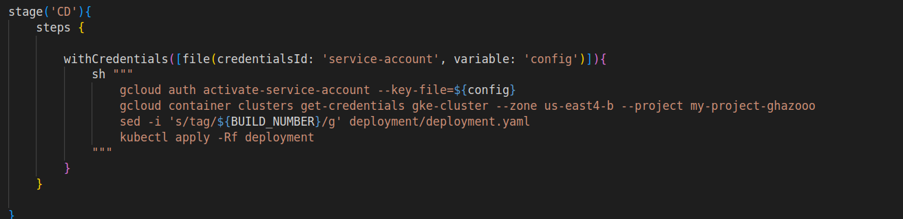
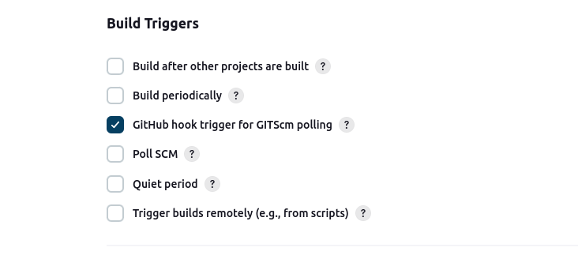
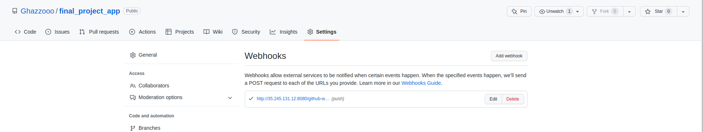
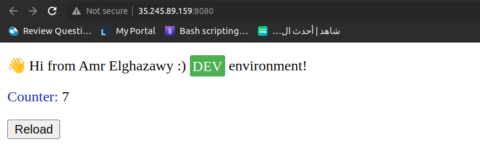

# ITI-DevOps-Final-Project-Application

## CI/CD Pipeline To Deploy the application

### Create credintials in Jenkins:

* Dockerhub credintials
* Key file of the new service account

### 1- Continuous Integration pipeline (CI):

### 2- Continuous Deployment pipeline (CD):

### 3- Trigger WebHook to Deploy with any push on github :

## The application backend

